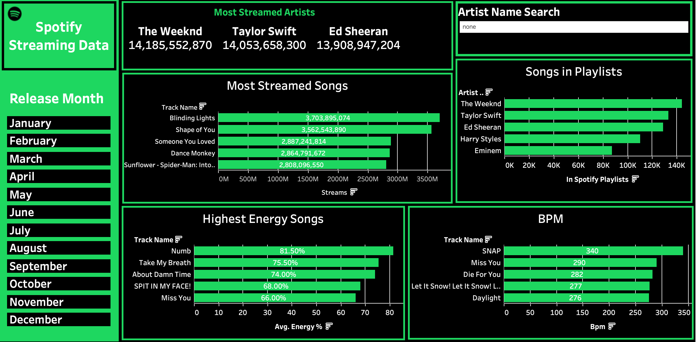

## Hi there 👋

## I am an aspiring data analyst who recently completed a 12 week data analytics bootcamp and I am now looking to land my first job in this field.

## The purpose of this profile is to serve as a portfolio of data projects I have created using Microsoft PowerBI, Tableau & SQL.

Please see below some previews of projects I've completed and click into the relevant repository for detailed information on how I put it together.

# Spotify Streaming Data Dashboard

# Cybersecurity Cost Analysis Dashboard

<!--
**joecockman/joecockman** is a ✨ _special_ ✨ repository because its `README.md` (this file) appears on your GitHub profile.

Here are some ideas to get you started:

- 🔭 I’m currently working on ...
- 🌱 I’m currently learning ...
- 👯 I’m looking to collaborate on ...
- 🤔 I’m looking for help with ...
- 💬 Ask me about ...
- 📫 How to reach me: ...
- 😄 Pronouns: ...
- ⚡ Fun fact: ...
-->
